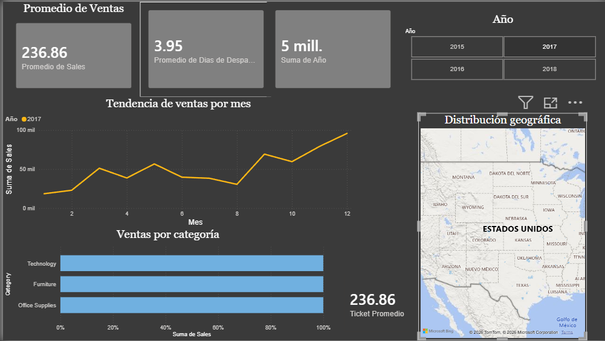

# Dashboard de Ventas — Superstore

## Descripción
Análisis completo de un dataset de ventas retail con más de 9,800 registros.
El proyecto incluye limpieza de datos con Python y visualización en Power BI.

## Vista previa


## Tecnologías utilizadas
- Python 3.14
- Pandas
- Matplotlib
- Power BI Desktop

## Estructura del proyecto
\```
-DASHBOARD-DE-VENTAS/
├── data/
│   └── train.csv
├── images/
│   └── Dashboard_preview.PNG
├── notebooks/
│   └── limpieza.ipynb
├── output/
│   └── ventas_limpio.csv
├── Dashboard_ventas.pbix
└── README.md
\```

## Proceso
1. Carga y exploración del dataset original
2. Limpieza: conversión de fechas y detección de nulos
3. Creación de columnas nuevas: Mes, Año, Días de Despacho
4. Agrupación de ventas por mes y año
5. Exportación del dataset limpio
6. Construcción del dashboard en Power BI con KPIs, tendencias, mapa y segmentación

## Hallazgos principales
- Los meses de mayor venta son septiembre y noviembre
- La categoría con mayores ventas es Technology
- El promedio de días de despacho es de X días

## Autor
Rafael Rodriguez — Ingeniería en Desarrollo de Software